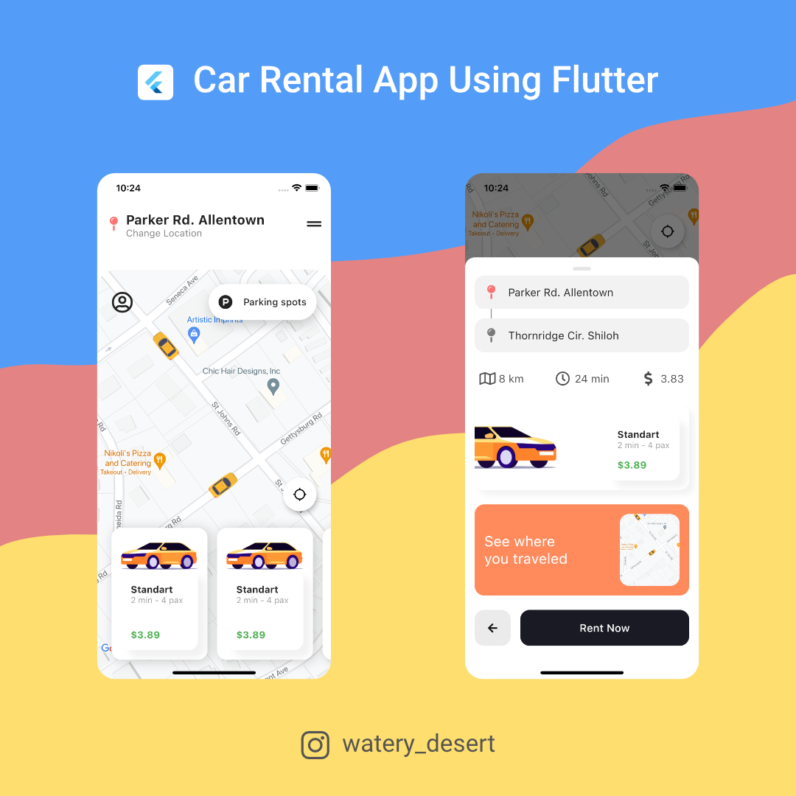

# car_rental_ronas_it

Taxi rental app using flutter. Add Google maps api key.

## App info

I have not implemented anything in this app. This is a bare bones project I haven't implemented BLoC (state management). You can watch [this youtube video by fireship.io](https://www.youtube.com/watch?v=MYHVyl-juUk) he explained how to add the backend. The app will get location data of other taxi and show it to user then user can pick. Everything can be done in realtime.

## Design credit

[Ronas IT](https://dribbble.com/shots/14028450-Car-Rental-App-Design-Concept/attachments/5645274?mode=media) & [Ilya Sablin](https://dribbble.com/shots/14416016-Car-Rental-Mobile-App-Design-Concept)

